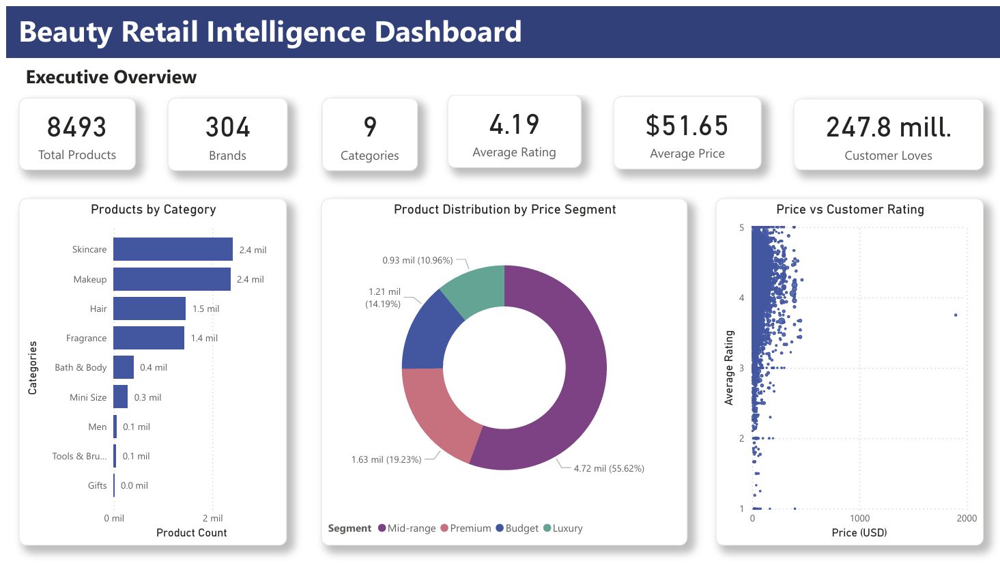
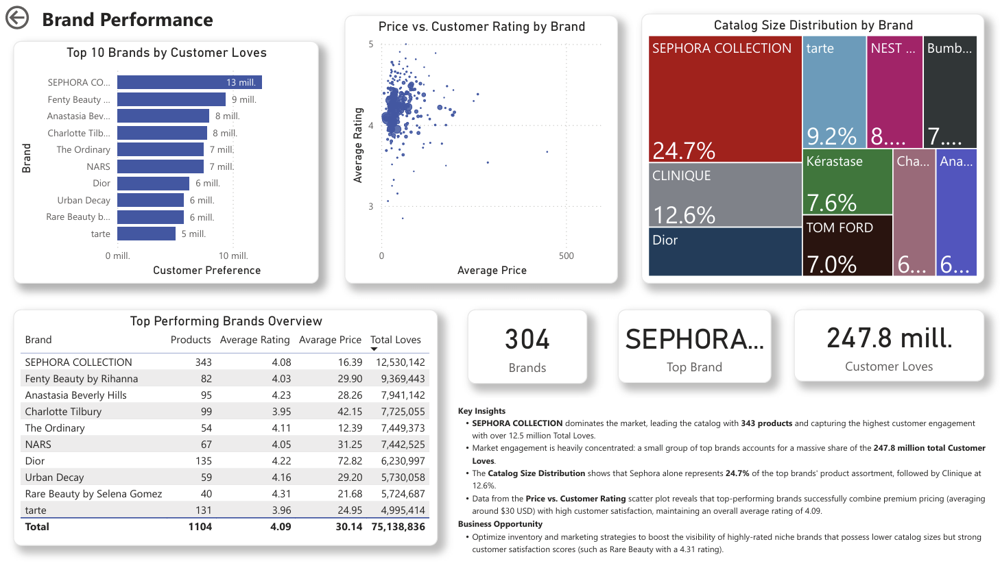
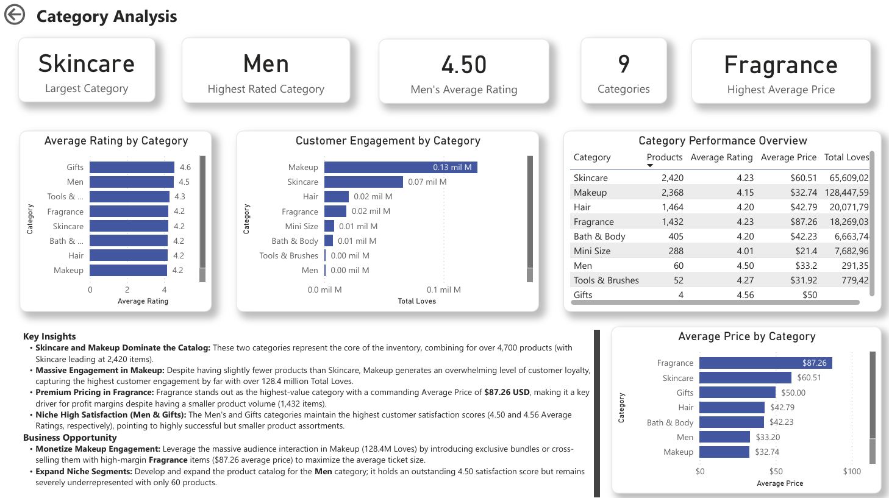
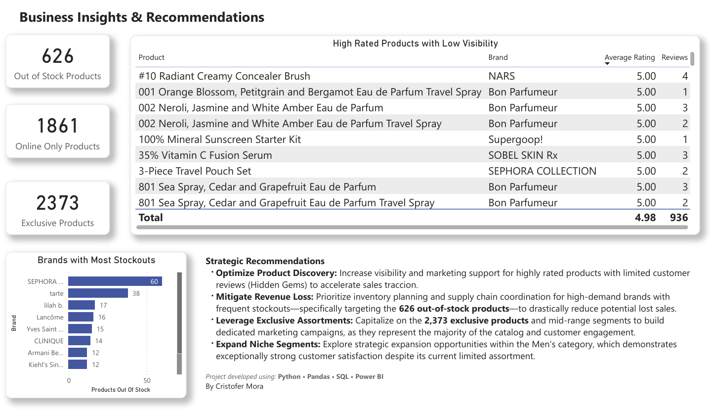

# Beauty Retail Intelligence

## Overview

This project analyzes product performance, customer engagement and pricing patterns within a beauty retail marketplace using Python, SQL and Power BI.

The objective is to transform raw product data into actionable business insights through exploratory data analysis, feature engineering and interactive dashboards.

## Objectives

- Explore product performance across brands and categories.
- Analyze the relationship between pricing and customer satisfaction.
- Measure customer engagement using ratings, reviews and favorites.
- Identify potential business opportunities through exploratory data analysis.
- Present findings using an interactive dashboard.

---

## Dataset

This project uses the **Sephora Products & Skincare Reviews** dataset available on Kaggle.

It contains:

- 8,000+ beauty products
- Product information
- Brand information
- Customer ratings
- Customer engagement metrics
- Approximately one million skincare reviews

## Tech Stack

- SQL
- Python
- Pandas
- Power BI
- Git & GitHub

---

## Business Questions

- Which brands generate the highest customer engagement?
- Which product categories receive the highest ratings?
- Does product price influence customer satisfaction?
- Which brands offer the best balance between price, rating and popularity?
- Which categories present the greatest business opportunities?
- Which products stand out because of their high customer interest?

---

## Feature Engineering

The following business features were created during data preparation:

- Price Segment (Budget, Mid-range, Premium, Luxury)
- Engagement Score
- Rating Level
- Cleaned analytical dataset for Power BI

## Project Workflow

1. Exploratory Data Analysis (Python & Pandas)
2. Data Cleaning
3. Feature Engineering
4. SQL Business Queries
5. Dashboard Development (Power BI)
6. Business Insights & Recommendations

## Dashboard

The Power BI dashboard is organized into four analytical pages:

### Executive Overview

General KPIs and marketplace overview.

---

### Brand Performance

Analysis of customer engagement and brand positioning.

---

### Category Analysis

Comparison of product categories based on pricing, ratings and engagement.

---

### Business Insights & Recommendations

Final business findings and strategic recommendations.

## SQL Analysis

Business queries were written to answer key analytical questions such as:

- Top brands by customer engagement
- Average rating by category
- Average price by category
- Stock availability by brand
- Price segment performance
- Hidden high-rated products

## Repository Structure

Beauty-Retail-Intelligence/

│
├── data/
│
├── notebooks/
│   ├── 01_eda.ipynb
│   ├── 02_feature_engineering.ipynb
│   └── 03_business_analysis.ipynb
│
├── sql/
│   └── business_queries.sql
│
├── dashboard/
│   └── Beauty_Retail_Intelligence.pbix
│
├── images/
│
└── README.md

---

## Future Improvements

- Customer sentiment analysis using NLP
- Product recommendation system
- Sales forecasting
- Customer segmentation
- Interactive filters with live retail data

## Key Takeaways

Through this project I practiced:

- Exploratory Data Analysis (EDA)
- Data Cleaning
- Feature Engineering
- SQL for business analysis
- Data Visualization
- Dashboard storytelling
- Business-oriented decision making

## Key Findings

- Makeup and Skincare represent the largest product categories.
- Mid-range products account for most of the catalog.
- Customer engagement is concentrated in a small number of major brands.
- Premium pricing does not necessarily result in higher customer ratings.
- Several highly rated products have very few reviews, suggesting opportunities to improve product visibility.
- Stock availability appears to be a potential issue for some high-demand brands.